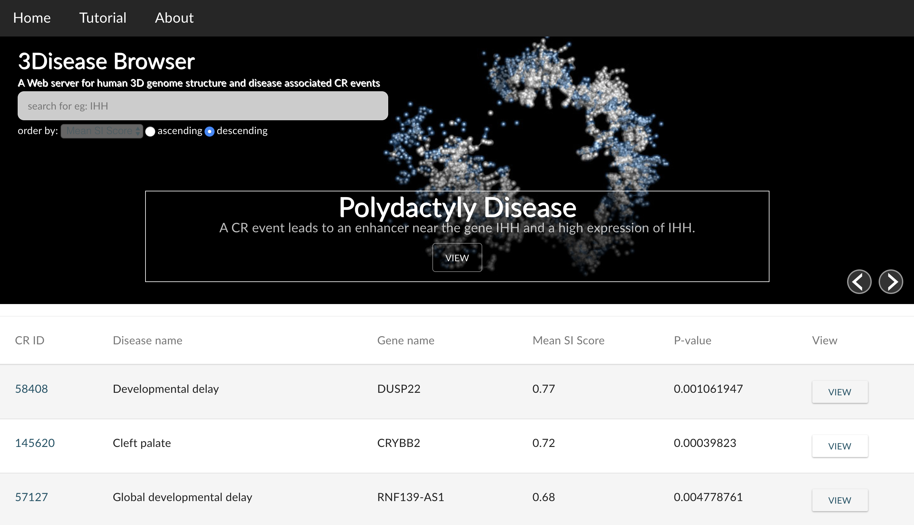

# 3Disease Browser

### Citing 3Disease Browser

If you use 3Disease Browser in your work, please cite:

> Ruifeng Li#, Yifang Liu#, Tingting Li, and Cheng Li. "3Disease Browser: a web server for integrating 3D genome and disease-associated chromosome rearrangement data."
> Scientific reports 6 (2016): 34651.
